<!--
SPDX-License-Identifier: CC-BY-4.0
Copyright (c) 2026 Pascal Dennerly.
-->

# Part 2 — Many systems: from repositories to one queryable graph

> **The problem:** a large enterprise has hundreds of repositories and no
> single document that says what the architecture actually is. Facts live in
> source code, config files, deployment manifests and READMEs, spread across
> many teams. "Which services call `payment_service`?" is answered by asking
> around — or not answering at all.
>
> **The GSL answer:** send an agent (human or LLM) into each repository to
> *recover* the architectural facts as **independent GSL fragments** — one
> per project, each carrying provenance and confidence. Compose the fragments
> into an enterprise graph, then answer cross-service questions by querying
> the graph, not by re-reading twenty repositories.

This is the second part of the [architecture archaeology study](../README.md).
[Part 1](../one-system/README.md) recovered one undocumented system; here the
same archaeology discipline is applied *many times, across many repositories*,
and the results are **composed** into an architectural knowledge graph.

The central idea:

> **LLMs (or engineers) perform the archaeology. GSL provides the durable,
> composable, reviewable representation of what they discovered.**
>
> The graph is the asset. Individual diagrams are merely views.

---

## The archaeology problem

Imagine an online retail platform. It has dozens — realistically hundreds —
of services, databases and external dependencies. Nobody drew the whole
picture, because nobody owns the whole picture:

- **customer-api** knows about orders (it places them) but nothing about
  payments.
- **order-service** knows about the payment service it calls, but nothing
  about the warehouse.
- **notification-service** knows which Kafka topics it listens to, but not
  who publishes them.

An engineer trying to answer *"what happens if `payments_db` goes down?"*
would have to read half the repositories to find out. An automated agent can
do that reading instead, and record what it finds in a form that **composes**.

This example contains a small but believable version of that enterprise.
The seven repositories themselves are *not* shipped with the example — real
repositories are too large and messy to bundle. What ships instead is what
an investigation actually produces: the facts, each one anchored to the
evidence it was read from.

The repositories an agent investigates:

- **customer-api** — the checkout and order-placing entry point;
- **catalogue-service** — catalogue reads, product pricing via inventory;
- **inventory-service** — a leaf service, no outbound calls;
- **order-service** — checkout, DSNs, one published event, one stale README claim;
- **payment-service** — PSP calls, ledger writes, one published event;
- **fulfilment-service** — warehouse worker listening to order events;
- **notification-service** — email provider, two event listeners.

---

## Step 1 — Investigate individual services

An agent investigates one repository at a time. Repositories are where the
facts live: service code shows calls, config shows connections, event
handlers show subscriptions, READMEs show intent (and sometimes stale
claims).

Here is what an agent would see in **order-service**: `checkout.go` calls
`catalogue.Price` (gRPC), reads `customer_db` (SQL), calls `payment.Create`
(gRPC), inserts into `order_db`, and publishes to the `order_events` topic;
`config.yaml` names both databases. But the repo also contains a claim that
is **not** backed by code:

```markdown
# README.md (order-service)
- reserves stock **directly via the inventory API** before creating a payment;
```

Nothing in `checkout.go` calls inventory — the stock path goes through
`catalogue_service`. That discrepancy is exactly the kind of thing an
archaeology pass should *record rather than resolve*.

Now look at **notification-service**, a repo with only three files. The
signal that matters is in the Kafka listener topics:

```markdown
# listener.go (notification-service)
// @KafkaListener(topics = "order.completed")
// @KafkaListener(topics = "payment_settled")
```

Notice the two event names side by side:

- order-service publishes `order_completed` (**underscore**);
- notification-service subscribes to `order.completed` (**dot**).

Same concept? Different topic? A listener that will never fire because
nothing publishes that name? **The agent cannot know from one repository.**
What it *can* do is record both facts, flag the listener as suspicious, and
let the composed graph make the mismatch visible to a human.

---

## Step 2 — Produce GSL fragments

Each investigation produces one small, self-contained GSL file. Two of the
seven are shown here in full (the rest are in `discovered/`):

```gsl
# discovered/order-service.gsl
set critical

node order_service [team="orders", source="repo", confidence="high"] @critical
node order_db [text="PostgreSQL", team="platform", source="config", confidence="high"] @critical
node order_events [text="Kafka topic: order_events", team="platform", source="config", confidence="high"]

order_service -> catalogue_service [protocol="grpc", source="code", confidence="high"]
order_service -> customer_db [protocol="sql", source="code", confidence="medium"]
order_service -> payment_service [protocol="grpc", source="code", confidence="high"]
order_service -> order_db [protocol="sql", source="config", confidence="high"]
order_service -> order_events [event="order_completed", protocol="pub", source="code", confidence="high"]
order_service -> inventory_service [protocol="grpc", source="docs", confidence="low"]
```

```gsl
# discovered/notification-service.gsl
set external
set suspected

node notification_service [team="engagement", source="repo", confidence="high"]
node email_platform [text="Email platform (SaaS)", team="external", source="config", confidence="high"] @external

notification_service -> email_platform [protocol="https", source="code", confidence="high"]
notification_service -> payment_events [event="payment_settled", protocol="sub", source="code", confidence="high"]
notification_service -> order_events [event="order.completed", protocol="sub", source="code", confidence="medium"] @suspected
```

Notice what the second file *did* with the naming conflict: it kept the event
name exactly as observed (`order.completed`), marked the edge
`confidence="medium"`, and put it in the `@suspected` set. Independent
investigations may disagree; **GSL does not force a single "true" fact** —
it stores what was observed.

The full set of fragments:

| Fragment | Declares | What the agent saw |
|----------|----------|--------------------|
| `discovered/customer-api.gsl` | customer entry point, `customer_db`, identity provider | checkout code, DSNs |
| `discovered/catalogue-service.gsl` | catalogue + `catalogue_db` | gRPC stock checks via inventory |
| `discovered/inventory-service.gsl` | inventory + `inventory_db` | leaf service, no outbound calls |
| `discovered/order-service.gsl` | order state machine + `order_db`, `order_events` | calls, DSNs, README claim, publisher |
| `discovered/payment-service.gsl` | payments + `payments_db`, `payment_events`, PSP | PSP call, ledger write, publisher |
| `discovered/fulfilment-service.gsl` | fulfilment + WMS | reads `order_db`, consumes `order_completed`, ships via WMS |
| `discovered/notification-service.gsl` | notifications + email platform | **dot-named** listener, receipts listener |

Each fragment is fully readable on its own and took one repository visit to
produce. No fragment contains the whole architecture — that is the point.

---

## Step 3 — Review the observations (provenance and uncertainty)

Every observation in these fragments carries two attributes:

- **`source`** — where the fact came from:
  - `code` — an explicit call or event handler in the source;
  - `config` — a connection string or base URL in configuration;
  - `docs` — claimed in a README/spec, **not** confirmed in code;
  - `repo` — the service itself exists (we read its repository).
- **`confidence`** — `high` / `medium` / `low`, i.e. how sure we are that
  the relationship exists as modelled.

> **This is a modelling convention, not a language feature.** GSL stores
> untyped attributes; nothing enforces `source` or `confidence`. That is a
> discipline of the archaeology workflow — the [one-system part
> (Part 1)](../one-system/README.md) established it and flagship
> [05](../../../flagships/05-llm-assisted-modelling/README.md) relied on it.
> GSL makes the discipline *visible* and *queryable*, which is what an
> enterprise needs.

Uncertainty is deliberately present in the composed model:

1. **`order_service -> inventory_service`** is `source="docs"`,
   `confidence="low"` — the README claim that no code backs. It has the same
   shape as every other edge, because it *might be true*. The review queue
   query (View 6) treats it as a question, not an answer.
2. **`notification_service -> order_events`** (`event="order.completed"`) is
   `source="code"`, `confidence="medium"`, `@suspected` — it is certainly in
   the code, but almost certainly wrong as a wiring. See View 2 and View 5
   for how the composed graph makes that visible.

None of this is hidden in footnotes; it is attribute data, waiting for a
query.

---

## Step 4 — Compose the enterprise graph

This is the step that makes the model more than the sum of its fragments.
There is no dedicated "merge" command in the GSL toolchain — and none is
needed, because composition is the language's own semantics:

> Concatenate the fragments and the parser performs a **declarative merge**:
> repeated node and set declarations merge (last-write-wins on attributes,
> set membership accumulates) and every edge is preserved as a distinct fact.

```bash
cat discovered/*.gsl > model.gsl
```

`model.gsl` *is* the composition — literally the seven fragment files pasted
together in one deterministic order. The `compose.sh` script reproduces it:

```bash
./compose.sh
gsl-query "" < model.gsl    # canonicalise: same graph, canonical ordering
```

Eighteen distinct nodes, twenty-two edges, all still carrying the provenance
of the fragment they came from:



Why does this work so cleanly? Because the fragments were designed to be
composable:

- node IDs are globally unique (`order_service`, not `service`);
- no two fragments claim different attributes for the same node;
- shared concepts (the `order_events` topic, `@critical`) are declared
  wherever they are used.

If two fragments *did* disagree about a node's attributes, last-write-wins
would resolve it silently — and GSL would **not** flag it. That is precisely
the reconciliation burden this example argues you should carry deliberately
(see the honest limitations below), and why the `discovered/` files should
stay separate until a human has reviewed them.

---

## Step 5 — Ask enterprise-level questions

With the composed graph in hand, questions that used to require reading many
repositories become one-line queries. Every result below was produced by the
real `gsl-query` CLI and committed as `qN-*.result.gsl`.

### View 1 — Who calls `payment_service`?

```bash
gsl-query -f q1-callers-of-payment.gql -i model.gsl
```

```gql
subgraph node.id == "payment_service" traverse in 1
```



`order_service` — and nobody else. Two independent fragments (`customer-api`
places orders, `order-service` makes the payment) had to be composed before
this single-hop answer existed in model form.

### View 2 — The `order_completed` event flow

```bash
gsl-query -f q2-order-completed-flow.gql -i model.gsl
```

```gql
subgraph edge.event == "order_completed"
```



One publisher (`order_service`), one consumer (`fulfilment_service`). Now
look at the result against the mismatch we recorded: where is
`notification_service`? It listens on `order.completed` — a name no one
publishes. The composed graph turned the async architecture into something
queryable, *and* made the broken wiring visible instead of pretending it did
not exist.

### View 3 — Blast radius of `payments_db`

```bash
gsl-query -f q3-payments-db-blast.gql -i model.gsl
```

```gql
subgraph node.id == "payments_db" traverse in all
```



`payments_db` sits behind `payment_service`, which is called by
`order_service`, which is called by `customer_api`. Four nodes across three
teams — an answer that no single repository contained. Walk the same query
`out` instead of `in` and you have "who is affected if this database becomes
unavailable", built from facts discovered independently.

### View 4 — The order journey dependency cone

```bash
gsl-query -f q4-order-journey.gql -i model.gsl
```

```gql
subgraph node.id == "order_service" traverse out all
```



Everything an order touches after `order_service` persists it: the catalogue,
inventory, two databases, the payment stack, the PSP, and both event topics.
Note the *low-confidence* `order_service -> inventory_service` edge (the
README claim) rides along in the journey — the cone does not silently
exclude disputed facts; it shows them so a reviewer can decide.

### View 5 — Event inventory: where the reconciliation gap lives

```bash
gsl-query -f q5-event-reconciliation.gql -i model.gsl
```

```gql
subgraph edge.event exists
```



All five pub/sub edges, side by side. `order_completed` (two edges),
`payment_settled` (two edges) — and `order.completed`, one edge, `@suspected`,
with no matching publisher. This is the reconciliation to-do list for a
human architect, derived from the model in one query. Nothing auto-reconciled
it; GQL merely made the discrepancy visible.

### View 6 — The architect's review queue

```bash
gsl-query -f q6-needs-verification.gql -i model.gsl
```

```gql
(subgraph edge.confidence == "low") as LOW | from * | (subgraph edge.confidence == "medium") as MED | LOW + MED
```



Three edges survive: the README-only inventory claim, the customer read at
checkout (config-consistent but an unusual cross-team SQL dependency), and
the `order.completed` listener. This is the deliverable of the archaeology:
**a prioritised list of what the composed architecture might have wrong.**
The `LOW + MED` union is the current GQL way to say "low **or** medium" —
GQL has no `OR` predicate yet, and graph algebra fills that gap.

You can slice provenance any way you want:

```gql
subgraph edge.source == "docs"
```

Every fact recorded from a README alone — a trust-this-last list for the next
architecture review.

### View 7 — The payments team's world

```bash
gsl-query -f q7-payments-team.gql -i model.gsl
```

```gql
subgraph node.team == "payments" traverse both 1
```



Everything the payments team's owned nodes touch: `order_service` (team
`orders`) calls in; `payments_db`, the external PSP and the `payment_events`
topic are all adjacent. Ownership questions — "which teams are involved in
the payment flow?" — become a query over `team` attributes.

---

## Step 6 — Generate focused views (you derive, you don't maintain)

Every illustration in Step 5 was produced by piping a query result into a
diagram converter:

```bash
gsl-query -f q1-callers-of-payment.gql -i model.gsl \
  | gsl-diagram -f mermaid -t graph > views/callers-of-payment.graph.mmd
```

Nothing was drawn by hand. When an archaeology fact changes, you edit
`discovered/` (or `model.gsl`), re-run `./compose.sh`, regenerate the
committed results with `go test ./examples -run Advanced`, and **every
diagram in this README updates**. You do not maintain seven architecture
diagrams; you maintain one composed graph and derive seven views.

---

## Scaling: the method, not the node count

This example has 18 nodes — small enough to read in two minutes. The
demonstration is the *method of scaling*, not a simulated 5,000-service
company:

```text
one repository        ->   one discovered GSL fragment
many repositories     ->   many discovered GSL fragments
many fragments        ->   one composed architecture graph
one graph             ->   many architecture questions and views
```

Each step is a unit of work that does not change size as the enterprise
grows: every repository is one fragment, fragments compose by concatenation,
and queries are written once and reused. A real enterprise does not need
one giant GSL file — it needs the discipline of many small ones and a
composition step.

---

## What this part demonstrates

- **Independent models compose.** Seven fragments produced by independent
  investigations merge into one graph with no merge tooling beyond GSL's own
  declarative semantics.
- **Cross-service relationships become queryable.** Callers, blast radius,
  event flows and journeys now have one-line answers that no single
  repository contained.
- **The composed graph is reviewable at the edges.** `source`, `confidence`,
  `@suspected` and `@critical` make the archaeology's uncertainty a query,
  not a footnote — the review queue is the deliverable.
- **An LLM can participate in architecture archaeology without its output
  becoming an opaque blob of prose** — every fragment is inspectable,
  composable and queryable, and flags its own uncertainty.

## In the real world

This part proves the **method**: independent fragments compose into a
queryable graph, and cross-service questions become one-liners. A real
deployment would layer the following on top:

- **A larger archaeology fleet.** The seven fragments here are a worked
  example; production archaeology covers hundreds of repositories, with
  agents (or teams) revisiting each periodically and committing the updated
  fragment. The graph grows by committing new files, not by editing one
  canonical document.
- **Tooling for provenance discipline.** `source` and `confidence` are
  conventions here, not enforced by the language. Validation tooling could
  require every edge to carry both, and flag fragments that omit them —
  making the discipline machine-checked without changing the language.
- **Event reconciliation at scale.** The `order_completed` vs
  `order.completed` mismatch is a small example of a real problem: many
  teams publish and consume events, and the names drift. A periodic
  reconciliation query over the graph — comparing publishers and consumers
  of each event — would surface every such mismatch, without re-reading any
  repository.

The graph is the durable asset; the queries are the questions; the workflow
is the archaeology discipline. **GSL makes all three inspectable and
auditable** — the rest is an organisation's integration work.

---

## Where this fits in the flagship line

Flagship [05 — LLM-assisted modelling](../../../flagships/05-llm-assisted-modelling/README.md)
asked: *"Can an LLM produce a reviewable GSL model from messy information?"* —
an experiment with one agent, one document, one model. The one-system part
of this study asks that same question for one undocumented system.

This part asks the next question: *"What happens when the approach is used
repeatedly across many repositories and the results are composed?"* — the
unit of work is the same, but the value moves from *a reviewable draft* to
*a queryable enterprise asset*. 05's loop — *draft → parse gate → review
diff → queries* — runs once per fragment here, before composition. This part
is the sequel, not a rewrite.

---

## Run the "two-minute test"

```bash
go test ./examples -run Advanced -v    # composition, queries and results, all verified
./compose.sh                           # re-compose the graph from the fragments
gsl-query 'subgraph node.id == "payment_service" traverse in 1' < model.gsl          # who calls payment
gsl-query 'subgraph edge.event == "order_completed"' < model.gsl                     # the event flow
gsl-query '(subgraph edge.confidence == "low") as LOW | from * | (subgraph edge.confidence == "medium") as MED | LOW + MED' < model.gsl  # what to verify
```

---

## Files

| File | What it is |
|------|-----------|
| `discovered/*.gsl` | seven independent investigation fragments, provenance attached |
| `model.gsl` | the composed enterprise graph (the *composition*, not a separate file) |
| `compose.sh` | reproduces `model.gsl` from the fragments with `cat` |
| `q1..q7` | the enterprise questions as executable query/result pairs |
| `views/` | derived charts — regenerated, never hand-maintained |