# 01 — One Graph, Many Views

> **The problem:** a platform team keeps architecture diagrams across
> multiple tools, wiki pages and hand-edited SVGs.  Every service boundary
> change requires editing *N* places.  Impact questions ("what breaks if we
> retire legacy-orders?") are answered by gut feel.
>
> **The answer:** a single canonical GSL graph that describes the real
> structure of the system.  Every diagram is *derived* from it with a
> `gsl-query | gsl-diagram` pipeline.

---

## Why this matters

| Hand-maintained Mermaid / PlantUML / DOT | GSL + GQL |
|------------------------------------------|-----------|
| Layout is the product                    | The graph is the product; layout is a derived view |
| Impact questions require a human to trace paths | `traverse in all` answers blast-radius in milliseconds |
| Ownership is a comment in the SVG source  | `node.team`, `@critical`, `@deprecated` are structured, queryable attributes |
| No canonical form; diffs are unreadable  | `gsl-query "" < model.gsl` canonicalises; diffs are small and reviewable |
| "One graph, many views" is aspirational  | `q1..q7` above are literally the same graph viewed through different pipelines |

---

## The model

Everything starts from **`model.gsl`** — one source of truth for:

- 20 owned services and datastores
- their `team`, `zone`, `replicas`
- which are `@critical` (load-bearing), `@deprecated` (retirement cohort), or `@external`
- every call, dependency and edge with `protocol` / `kind`

```bash
cat model.gsl                     # read the source of truth
gsl-query "" < model.gsl          # canonicalise
```

Open `model.gsl` in any editor and edit freely.  Every view below is re-derived from it.

---

## View 1 — Full architecture diagram

The *whole* graph, rendered as a component diagram:

```bash
gsl-query 'from *' < model.gsl | gsl-diagram -f mermaid -t component
```



And the same graph as a Mermaid directed graph:

```bash
gsl-query 'from *' < model.gsl | gsl-diagram -f mermaid -t graph
```


---

## View 2 — Blast radius of retiring the legacy order monolith

*"If we pull the plug on legacy-orders, who breaks?"*

```bash
gsl-query '(subgraph node.id == "legacy-orders" traverse in all) as BLAST | from BLAST' < model.gsl \
| gsl-diagram -f mermaid -t graph
```

The full transitive dependency cone — every node that transitively
depends on `legacy-orders`:



The **critical subset** — just the `@critical` nodes that break:

```bash
gsl-query '(subgraph node.id == "legacy-orders" traverse in all) as BLAST | from * | (subgraph node in @critical) as CRIT | BLAST & CRIT' < model.gsl \
| gsl-diagram -f mermaid -t graph
```



Retiring legacy-orders breaks `gateway → orders` — two critical
services.  That is a runbook-worthy fact; you derived it, not guessed it.

---

## View 3 — Payments team dependencies

*"What does the payments team directly call?"*

```bash
gsl-query 'subgraph node.team == "payments" traverse out 1' < model.gsl \
| gsl-diagram -f mermaid -t graph
```



Payments and fraud (both `team="payments"`) plus the databases and card
network they call.  A team-scoped diagram generated from the canonical
graph — no hand-drawn diagram to forget to update.

---

## View 4 — Team-level dependency graph

*"Which teams depend on which teams?"*

```bash
gsl-query 'collapse into team_gateway where node.team == "gateway" | collapse into team_orders where node.team == "orders" | collapse into team_payments where node.team == "payments" | collapse into team_identity where node.team == "identity" | collapse into team_fulfilment where node.team == "fulfilment" | collapse into team_storefront where node.team == "storefront" | collapse into team_platform where node.team == "platform" | collapse into team_legacy where node.team == "legacy"' < model.gsl \
| gsl-diagram -f mermaid -t component
```



Every 20-service node collapses into a single "team" node.  The resulting
graph is what leadership wants; it was one query away from the detailed
model.

> **Note on labels:** the `text` attribute from collapsed nodes becomes the
> visual label.  If you don't want `team_platform` labelled as `"Redis"` in
> this view, omit the `text` attribute or add a dedicated `display`
> attribute and adapt the converter — or remove `text` from the platform
> nodes in a view-only pipeline (`remove node.text where ...`).

---

## View 5 — What depends on deprecated components?

*"Migration view: what still talks to @deprecated nodes?"*

```bash
gsl-query '(subgraph node in @deprecated traverse in all) as DEP | from DEP' < model.gsl \
| gsl-diagram -f mermaid -t graph
```



Everything that transitively depends on the `@deprecated` cohort:
web/mobile (via redis-cache), gateway (via orders → legacy),
catalog/search (via redis-cache), etc.  This is the migration backlog
derived from the graph, not a spreadsheet.

---

## View 6 — Business-critical reach

*"What does the business-critical infrastructure transitively touch?"*

```bash
gsl-query '(subgraph node in @critical traverse out all) as REACH | from REACH' < model.gsl \
| gsl-diagram -f mermaid -t graph
```

This is a *large* derived graph — nearly the whole system — which is the
point: critical services have deep reach.  That fact is a structural
property of the system, visible in the model.

---

## Run the "two-minute test"

```bash
# canonicalise the model
gsl-query "" < model.gsl

# answer "what breaks if we retire legacy-orders?"
gsl-query '(subgraph node.id == "legacy-orders" traverse in all) as BLAST | from * | (subgraph node in @critical) as CRIT | BLAST & CRIT' < model.gsl

# show the payments team's one-hop neighbourhood
gsl-query 'subgraph node.team == "payments" traverse out 1' < model.gsl

# collapse to team-level
gsl-query 'collapse into team_gateway where node.team == "gateway" | collapse into team_orders where node.team == "orders" | collapse into team_payments where node.team == "payments"' < model.gsl
```

Every command above produces **canonical GSL** — stable, reviewable, diffable.

---

## How the views were generated

The committed `.mmd` files in `views/` are illustrative illustrations
generated by the above commands.  Mermaid converters iterate Go maps, so
re-running the *same* command may reorder diagram lines; the **canonical
GSL output** (`*.result.gsl`) is the deterministic, testable contract.

To regenerate any view:

```bash
# example: team component diagram
gsl-query -f q6-team-view.gql -i model.gsl \
| gsl-diagram -f mermaid -t component > views/team-view.component.mmd
```

---

## What this example is *not*

- It is not a complete service catalogue (no SLAs, no runbooks).
- It is not a deployment diagram (no host/port details beyond `zone`).
- It does not model runtime conditions, traffic, or latency.
- The `@critical` tags are a modelling choice someone must keep current.

These are the right limitations.  The graph is valuable precisely because
it is a *structural* model — lightweight enough that keeping it current
fits in a PR review.

---

## Related views not included

| Question | Query (run it yourself) |
|----------|------------------------|
| What's in zone A? | `subgraph node.zone == "A"` |
| All async edges | `subgraph edge.kind == "async"` |
| External dependency map | `subgraph node in @external traverse in all` |
| Canonical diff (identity) | `gsl-query "" < model.gsl > model.canonical.gsl` |

---

## Limitations

- Blast radius is **static structure only** — no runtime traffic or failure
  probabilities.
- `@critical` is a tagging choice; it does not propagate automatically.
- Set membership is manually maintained — there is no auto-inference of
  "criticality" from downstream consumers.
- `traverse in all` follows the *graph* edges, not runtime call graphs.
  Model accurately.
