<!--
SPDX-License-Identifier: CC-BY-4.0
Copyright (c) 2026 Pascal Dennerly.
-->

# 02 — Architecture Archaeology: Reconstructing an Undocumented Monolith

> **The problem:** you inherit a decade-old, undocumented order-fulfilment
> system. Nobody knows what talks to what. There is a hand-drawn diagram from
> 2018 that nobody trusts. You need a credible structural model to plan work
> and onboard new engineers.
>
> **The GSL answer:** while you're still digging, you record each recovered
> fact *with its provenance* — where the evidence came from and how
> confident you are. That model is the deliverable, and it improves in git
> as evidence mounts. Diagrams are the products of queries, drawn fresh.

The distinctive thing here is not just the graph — it's that GSL lets you
carry **metadata about the evidence** and turn that metadata into different
views.

---

## The model

`model.gsl` is the archaeology ledger:

- 12 recovered components
- each node/edge tagged with `source` — where the fact was found:
  - `logs` — observed in application/access logs
  - `deploy` — inferred from manifests, cron, config
  - `interview` — reported from memory, possibly wrong
- each node/edge tagged with `confidence`: `high` / `medium` / `low`
- set membership records the working hypothesis:
  - `@confirmed` — we're confident this component exists as modelled
  - `@suspected` — provisional, awaiting evidence
  - `@critical` — believed load-bearing



---

## View 1 — The confirmed skeleton

*"Show management the diagram you'll bet on."*

```bash
gsl-query 'subgraph node in @confirmed | remove edge where edge.confidence != "high" | remove orphans' < model.gsl \
| gsl-diagram -f mermaid -t graph
```



Only components we're sure exist (`@confirmed`), connected only by
directly-observed edges (`confidence == "high"`), with nodes orphaned by
that filter removed. This is the conservative diagram — suitable for a
board or an incident.

> The `text` attribute controls diagram labels; `source`/`confidence`
> remain on the model regardless of what a view shows.

---

## View 2 — Suspected structure feeding load-bearing components

*"Which unconfirmed parts do we *already know* touch critical
infrastructure?"*

```bash
gsl-query '(subgraph node in @critical traverse in all) as CRITCHAIN | from CRITCHAIN | subgraph node in @suspected' < model.gsl \
| gsl-diagram -f mermaid -t graph
```



Start from the `@critical` components, walk **in** (who feeds them), then
keep only the elements still marked `@suspected`. The answer:

- `scheduler` — unattended, low-confidence, but pokes the monolith
- `staging_db` — used by scheduler and reporting, and (per one
  low-confidence edge) reads the live database
- `reporting_job` — interview-only knowledge

These three are the highest-risk unknowns. That's a prioritised
investigation list *derived from the model*.

---

## View 3 — The monolith's one-hop world

*"What does the monolith directly touch?"*

```bash
gsl-query 'subgraph node.id == "legacy_monolith" traverse both 1' < model.gsl \
| gsl-diagram -f mermaid -t graph
```



Both directions — things the monolith calls *and* things that call it.
For an archaeology target this is the "live wires" view: anything this
node touches is in scope when you decompose it.

---

## View 4 — What the worker drives

*"If the fulfilment worker is rebuilt first, what must stay compatible?"*

```bash
gsl-query 'subgraph node.id == "worker" traverse out all' < model.gsl \
| gsl-diagram -f mermaid -t graph
```



The worker writes to the live database, offloads files to `ftp_outbox`,
archives to object storage, and (allegedly) emails. This is the
compatibility contract for the replacement — derived, not deduced.

---

## View 5 — Everything we only "know" from interviews

*"The trust-this-last list."*

```bash
gsl-query 'subgraph node.source == "interview"' < model.gsl \
| gsl-diagram -f mermaid -t graph
```



`emailer` and `reporting_job` exist only in someone's memory. If you're
about to redesign around them, verify them first. One predicate, one
answer.

---

## The archaeology loop in git

This is where GSL earns its keep.

1. A week-one claim: `reporting_job` exists, described from memory.

```gsl
node reporting_job [source="interview", confidence="low"] @suspected
```

2. You find its cron config. Update the model — one line changes.

```gsl
node reporting_job [source="deploy", confidence="medium"] @confirmed
```

3. The diff is a single line. **The model tells the archaeology story in
   git history.** Diagrams were never edited by hand — they'd have been out
   of date before you started.

Verify: canonicalise the model with `gsl-query "" < model.gsl` and watch
every view change with the next `gsl-query | gsl-diagram`.

---

## Run the "two-minute test"

```bash
gsl-query "" < model.gsl                          # canonicalise the ledger
gsl-query 'subgraph node in @confirmed | remove edge where edge.confidence != "high" | remove orphans' < model.gsl  # the diagram you'll bet on
gsl-query '(subgraph node in @critical traverse in all) as CRITCHAIN | from CRITCHAIN | subgraph node in @suspected' < model.gsl  # risk prioritisation
gsl-query 'subgraph node.source == "interview"' < model.gsl  # trust-this-last
```

---

## What this example is *not*

- It is not a log-analysis pipeline. GSL is the *store* for what the
  analysis found — feeding it from real tooling is integration work.
- `confidence` is metadata, not truth. The model is only as good as the
  archaeology that fills it.
- There is no schema validation: GSL won't warn you that your model is
  missing the queue if you never found it.

---

## Limitations

- `@suspected` and `@critical` are independent tags; nothing auto-promotes
  a suspected node when its confidence rises. Update the sets yourself —
  that's the discipline, and the git diff is the audit trail.
- Blast-radius-style queries give structure, not behaviour: "feeds
  critical" means there is a path in the graph, not that traffic flows.
- The archaeology conclusion (which unknowns to resolve first) is a human
  judgement; GQL supplies the evidence, not the decision.