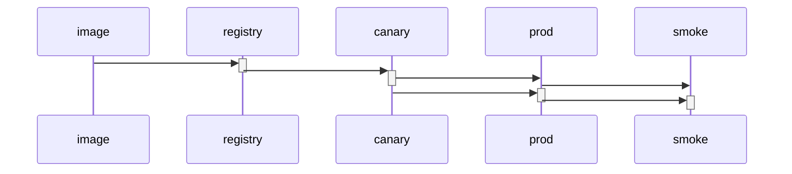

<!--
SPDX-License-Identifier: CC-BY-4.0
Copyright (c) 2026 Pascal Dennerly.
-->

# 02 — Release Prerequisites: A Relationship Between Relationships

> **The problem:** releasing to production involves parallel tracks that must
> rejoin. The image is built and published on one track; configuration is
> applied and approved on another. The promotion into production must wait
> for the **config approval** — a dependency not between two *things* but
> between two *steps*.
>
> **The GSL answer:** GSL's edge dependencies model this directly. An edge
> (`PROMOTE`) can declare a *parent edge* (`GATE`) it depends on. That makes
> prerequisites first-class — queryable, diffable, and re-usable.

This example intentionally goes beyond the syntax demo in
`examples/02-algorithms/task_dependencies.gsl`: it's a single realistic
release with a story, questions, and derived views.

---

## The model

Two tracks diverge from the start and rejoin at production.

```bash
gsl-query "" < model.gsl
```

produces the canonical form, where edge dependencies are rendered as
**nested blocks**:

```
CHECKOUT: checkout->build [stage="build"] {
    TEST: build->test [stage="test"]
    SCAN: build->scan [stage="scan"]
    PKG: build->image [stage="package"] {
        PUSH: image->registry [stage="push"]
    }
}
CONFIG: config->controlplane [stage="apply"] {
    GATE: controlplane->approve [stage="gate"] {
        PROMOTE: registry->canary [stage="promote"] {
            CANARY: canary->prod [stage="ship"]
            SMOKE: prod->smoke [stage="smoke"]
        }
    }
}
```

Read the nesting: the **entire deploy track is nested inside the approval
track**. That indentation *is* the dependency you need to communicate — and
it's data, not presentation.

Key declarations:

```gsl
CONFIG: config -> controlplane [stage="apply"]
GATE: controlplane -> approve [stage="gate", parent=CONFIG]
PROMOTE: registry -> canary [stage="promote", parent=GATE] {
    CANARY: canary -> prod [stage="ship"]
    SMOKE: prod -> smoke [stage="smoke"]
}
```

`PROMOTE` names `GATE` as its prerequisite — a relationship between
**edges**. In mainstream diagram syntax this would be a hand-drawn arrow
only a human can read; here it is a first-class relation you can query.



---

## View 1 — What runs only after something else?

```bash
gsl-query 'subgraph edge parent exists' < model.gsl
```



Nine of the ten steps depend on a previous step (all but `checkout` and
applying config). The nested canonical output shows the whole dependency
structure at a glance.

---

## View 2 — The deploy spine gated on approval

*"Which release steps are released by the config-approval gate?"*

```bash
gsl-query 'subgraph edge depends on edge.stage == "gate" scope' < model.gsl
```

`edge depends on edge.stage == "gate"` selects edges whose **parent** is
the gate step; `scope` expands it to all descendants (everything the
promotion unlocks):



The answer is exactly the deploy spine: `PROMOTE → CANARY → SMOKE`. If the
gate is red, none of these run.

---

## View 3 — The approval impact zone

```bash
gsl-query 'subgraph edge.stage == "gate" scope' < model.gsl
```

`scope` expands a matched edge to all its descendants — equivalent to
`traverse down all`:



Note the canonical nesting: `CONFIG` appears because serialization keeps
the structural context of its child `GATE`. The impact zone is computed,
not eyeballed.

---

## View 4 — Entry points

```bash
gsl-query 'subgraph edge.depth == 0' < model.gsl
```

`edge.depth` is 0 for edges with no prerequisite. This release has exactly
two: `CHECKOUT` (build track) and `CONFIG` (config track). Depth analysis
(often done by walking a task graph with custom code) is a predicate.

---

## View 5 — Tag the gated steps

*"Mark everything behind the approval gate."*

```bash
gsl-query 'subgraph edge.stage == "gate" scope | make edge.prereq = "approval" where edge.stage exists' < model.gsl
```

Every edge in the impact zone now carries `prereq="approval"` — a derived
attribute that downstream tooling (or a later pipeline stage consuming
canonical GSL) can rely on:

```
CONFIG: config->controlplane [prereq="approval", stage="apply"] {
    GATE: controlplane->approve [prereq="approval", stage="gate"] {
        PROMOTE: registry->canary [prereq="approval", stage="promote"] {
            CANARY: canary->prod [prereq="approval", stage="ship"]
            SMOKE: prod->smoke [prereq="approval", stage="smoke"]
        }
    }
}
```

---

## View 6 — The same facts in a different dialect

The pipeline shaped as a Mermaid **sequence diagram** — nested scoped
blocks become call activations:

```bash
gsl-query -f q2-gated-deploy-spine.gql < model.gsl | gsl-diagram -f mermaid -t sequence
```



One model, three dialects (graph, canonical GSL, sequence). No second
source of truth was created to get the third diagram.

---

## Run the "two-minute test"

```bash
gsl-query "subgraph edge depends on edge.stage == \"gate\" scope" < model.gsl   # what the gate unlocks
gsl-query "subgraph edge.depth == 0" < model.gsl                                # entry points
gsl-query "subgraph edge parent exists" < model.gsl                             # every prerequisite
```

---

## Modelling conventions used here

- `parent=LABEL` on a labeled edge declares a **prerequisite**: this edge
  depends on the labeled edge.
- Blocks (`A -> B { … }`) do the same implicitly for nested edges — GSL
  never lets the *shape* of the dependency be separate from its semantics.
- `stage` is a plain attribute chosen so queries can address steps
  semantically (`edge.stage == "gate"`). Edge *labels* are identifiers for
  the parent relation, not a query filter.

---

## Limitations

- **One parent per edge only.** An edge has a single prerequisite; you
  cannot declare "PROMOTE requires BOTH the gate approval AND the scan to
  pass" in one edge. Model such AND-joins as chained edges/nodes instead
  — a genuine GQL limitation, not silently papered over.
- Edge prerequisites are **structural**. Nothing validates that "parent
  completed" actually implies "this edge runs"; the semantics are whatever
  your workflow engine does. GSL stays a *model*.
- `depends on` matches the **direct** parent, not transitive ancestors —
  combine with `scope` when you want the whole subtree, exactly as in
  Query 2.

---

## Why this example is not the existing task_dependencies demo

`examples/02-algorithms/task_dependencies.gsl` demonstrates *syntax*.
This flagship answers realistic questions with realistic pipelines:
parallel tracks, a cross-track gate, depth analysis, derived attributes,
and a sequence view — the "one graph, many views" story applied to
workflows, not just service topologies.