<!--
SPDX-License-Identifier: CC-BY-4.0
Copyright (c) 2026 Pascal Dennerly.
-->

# 03 — Architecture Across Boundaries

> **The problem:** a retail platform must be understood from several
> independent perspectives at once — geography, environment, trust boundary,
> data classification, ownership. A single hierarchy cannot hold all of them.
> Choose one, and the others become footnotes that nobody reads.
>
> **The GSL answer:** one graph holds the relationships. Sets overlay the
> classifications — flat, independent, orthogonal. Any perspective is a query
> away, and the surprising overlaps are facts to discuss, not bugs to hide.

Northstar runs an internet storefront in two regions and two environments,
across four trust classifications, three data classes and four owning teams.
None of those five dimensions is a child of another — the platform is a
**single graph**.

---

## The problem

Every architecture description faces the same question: *what is the root of
the tree?* Deploy a component diagram and you have grouped by region. Add
"which team owns it" and you need a second diagram. Throw in data
classification and a third — each diagram right, none matching the others.

Northstar is the platform to enjoy that problem at full strength:

- components run in `@europe` **and** `@north_america`;
- they live in `@production`, with some rehearsed in `@staging`;
- they sit in one of four trust classifications — `@public`, `@application`,
  `@restricted`, or outside the platform entirely (`@external`);
- they touch `@internal_data`, `@confidential_data`, or
  `@highly_confidential_data`; and
- they are owned by `@commerce`, `@platform`, `@security`, or `@operations`.

Pick any root and the collapse is instant:

```text
Production
└── Europe
    └── Commerce
        └── Payment service
```

That tree is *true* — and useless. A payment service that is *restricted,
highly-confidential, North-America, commerce-owned* cannot sit underneath
"Europe", "production" or "commerce". It sits underneath all of them, and
underneath none. Try four more trees and you have the diagram set that already
drove the org to GSL.

A tree forces a **single** parent. Northstar's components have five
independent identities, and membership is a fact, not a position in a tree:

```gsl
node payment_service @production @north_america @restricted @highly_confidential_data @commerce
node event_bus @production @staging @europe @application @confidential_data @highly_confidential_data @platform
```

Each line declares *all* of that component's classifications. No nesting, no
invention of "the" hierarchy. A hierarchy is still useful — as a derived
view, later, for a specific reader. It is what a query produces, not what a
model stores.

## The model

`model.gsl` is the Northstar dependency graph: 18 components, 25 edges, 15
sets declared up front. Edges carry what they are (`protocol`,
`event`/`pub|sub` labels); nodes carry *where they are* in every dimension at
once:

```gsl
node web_portal [text="Web Portal"] @production @europe @public @internal_data @commerce
node payment_service @production @north_america @restricted @highly_confidential_data @commerce
```

The set declarations are not decoration: an undeclared membership is a GSL
warning, so an accidental `@europe` typo is a *recorded* problem, not a silent
line in `model.gsl`.

The full membership table (readable as English, and queried as facts):

| Component | Location | Trust | Data | Owner |
|---|---|---|---|---|
| web_portal | europe | public | internal | commerce |
| customer_api | europe | application | confidential | commerce |
| catalogue_service | europe (prod+staging) | application | internal | commerce |
| order_service | europe | application | confidential | commerce |
| payment_service | north_america | restricted | highly-confidential | commerce |
| customer_service | europe | application | confidential | commerce |
| fraud_service | north_america | application | confidential | security |
| fulfilment_service | north_america | application | internal | operations |
| notification_service | europe | application | confidential | operations |
| catalogue_store | europe | application | internal | platform |
| order_store | europe | restricted | confidential | platform |
| payment_store | north_america | restricted | highly-confidential | platform |
| customer_store | europe | restricted | confidential | platform |
| event_bus | europe (prod+staging) | application | confidential + highly-confidential | platform |
| observability | europe | application | internal | operations |
| payment_gateway | — | external | — | — |
| email_provider | — | external | — | — |
| identity_provider | — | external | — | — |

The whole graph, no hierarchy, one file:



## The classifications

Five dimensions, fifteen sets, one function each:

| Dimension | Sets | Question it answers |
|---|---|---|
| Environment | `@production`, `@staging` | Where does it *run / where is it rehearsed*? |
| Geography | `@europe`, `@north_america` | Which region hosts it? |
| Trust | `@public`, `@application`, `@restricted`, `@external` | Where does it sit relative to Northstar's boundary? |
| Data | `@internal_data`, `@confidential_data`, `@highly_confidential_data` | What is the most sensitive payload it touches? |
| Ownership | `@commerce`, `@platform`, `@security`, `@operations` | Which team is accountable? |

Two classifications deserve an explicit note before we trust them.

**A component can carry more than one value inside a dimension.** `event_bus`
carries `@confidential_data` **and** `@highly_confidential_data`. That is not
a mistake — it is the semantics the dimension needs. The bus carries two
streams with different sensitivities: `order_placed` events hold customer PII
(confidential); `payment_settled` events hold tokenised card data
(highly-confidential). Northstar therefore records the bus in both
classifications; any controls applied to them are organisational policy
outside GSL. This is the punchline of [the second question](#q2--which-production-components-in-europe-touch-highly-confidential-data):
the only production-and-Europe component touching highly-confidential data is
a *bus*, not a store.

**`@external` is not a derived convenience and not a sixth dimension.** It is
the fourth member of the trust dimension: the payment gateway, email provider
and identity provider are *outside Northstar's boundary*. Internal nodes are
members of all five dimensions; external nodes are members of exactly one set
— Northstar records control, and does not apply internal policy dimensions
to vendors. `@external` cannot be cleanly re-derived either: "not in
`@production` and not in `@staging`" already smuggles the boundary decision
in. So it is recorded, not computed. Reading the four as `@public` →
`@application` → `@restricted` → `@external` is for convenience only — GSL
defines no ordering between them — and, as the next section shows, it explains
nothing about the other four dimensions.

## Why the memberships are not a hierarchy

The moment you hold all five dimensions at once, the crossings become the
architecture:

- **A highly-confidential service outside Europe is policy, not error.**
  `payment_service` and `payment_store` run in `@north_america` while
  `@confidential_data` PII lives in Europe. Data classification has no
  geography in Northstar's policy.
- **`notification_service` holds customer PII (`@confidential_data`) inside
  `@application`, the same boundary as the public catalogue.** Northstar's
  policy restricts where *customer records rest* (the stores), not where
  *notifications read them*.
- **`fraud_service` is `@security`-owned yet inside `@commerce`'s checkout**
  (payment_service calls it), and it reads the commerce `customer_store`.
  The security team owns a component the commerce team cannot operate without.
- **One operational group, two continents.** `fulfilment_service`
  (`@north_america`) and `notification_service` (`@europe`) are both
  `@operations`.
- **`@application` contains all four owners.** It is a boundary, not a team.

None of these is a modelling error. Each is a real, sometimes uncomfortable,
organisational fact that a single-rooted tree would have forced you to
suppress at write time.

"Independent" has a precise meaning here: **no dimension is a function of any
other.** If knowing one classification let you predict another, the sets would
just be a disguised hierarchy. They are not. Proof by counterexample, all
inside `model.gsl`:

| Claim | Counterexample |
|---|---|
| trust is a function of geography | `@europe` spans `@public`/`@application`/`@restricted`; `@north_america` spans `@application`/`@restricted` |
| data is a function of trust | `@restricted` spans `@confidential_data`/`@highly_confidential_data`; `@application` spans all three data classes |
| owner is a function of trust | `@restricted` spans `@commerce` (payment_service) and `@platform` (three stores) |
| geography is a function of data | `@highly_confidential_data` spans `@europe` (event_bus) and `@north_america` (payment_service, payment_store) |
| data is a function of owner | `@platform` spans all three data classes; `@commerce` spans internal/confidential/highly-confidential |
| owner is a function of geography | `@europe` spans `@commerce`/`@platform`/`@operations`; `@north_america` spans `@commerce`/`@security`/`@operations`/`@platform` |

The bar here is *derivability*, not *exhaustiveness*: every combination need
not exist (only catalogue_service and event_bus are ever in `@staging`, and
that is a real Northstar fact — staging is a European rehearsal, deployed
before production, not a separate dimension). What matters is that knowing
any one classification leaves the others genuinely unpredictable — the queries
below are only interesting because of that.

## Ask questions

The six committed queries are one line each. Run any with the `gsl-query`
CLI — answers print as **canonical GSL text** (starting with the sorted `set`
declarations; the contract the `qN-*.result.gsl` files record). To *draw* one,
chain `gsl-diagram` as the final hop, since raw `gsl-query` output is rejected
by a mermaid renderer:

```bash
gsl-query -f q1-europe.gql -i model.gsl
gsl-query -f q1-europe.gql -i model.gsl | gsl-diagram -f mermaid -t graph
```

### Q1 — What runs in Europe?

```gql
subgraph node in @europe
```

Eleven components and the edges between them — every store, API, bus and
observer that Northstar deploys in Europe:

```gsl
node web_portal [text="Web Portal"] @commerce @europe @internal_data @production @public
node catalogue_service @application @commerce @europe @internal_data @production @staging
node event_bus [text="Event Bus"] @application @confidential_data @europe @highly_confidential_data @platform @production @staging
```

(Truncated: the committed `q1-europe.result.gsl` holds all 11 nodes and 14
edges, with `catalogue_service` and `event_bus` showing their `@staging`
rehearsal membership beside `@production`.)



### Q2 — Which production components in Europe touch highly-confidential data?

```gql
subgraph node in @production AND node in @europe AND node in @highly_confidential_data
```

Three constraints, one predicate each, **one answer**:

```gsl
node event_bus [text="Event Bus"] @application @confidential_data @europe @highly_confidential_data @platform @production @staging
```

The bus, and nothing else — not `payment_service` (it is in North America),
not a store. The union of "Europe", "production" and "highly-confidential" is
a single conduit that a hierarchy would never have had an answer standing for.

### Q3 — Which commerce-owned components are restricted?

```gql
subgraph node in @commerce AND node in @restricted
```

Two dimensions at the same time — ownership and trust:

```gsl
node payment_service @commerce @highly_confidential_data @north_america @production @restricted
```

One node. The three restricted stores are all `@platform`-owned; the commerce
team's *only* restricted component is the service it depends on most. That is
an ownership fact, visible in two predicates.

### Q4 — Which commerce components transitively depend on restricted components?

```gql
(subgraph node in @restricted traverse in all) as REST | from * | (subgraph node in @commerce) as COM | REST & COM
```

Now the graph and the sets work together. REST is the blast radius of the
restricted boundary reached by following calls *backwards*; COM is the
commerce set; `REST & COM` is their intersection — the checkout chain:

```gsl
node web_portal [text="Web Portal"] @commerce @europe @internal_data @production @public
node customer_api [text="Customer API"] @application @commerce @confidential_data @europe @production
node order_service @application @commerce @confidential_data @europe @production
node customer_service @application @commerce @confidential_data @europe @production
node payment_service @commerce @highly_confidential_data @north_america @production @restricted

web_portal->customer_api [protocol="https"]
customer_api->order_service [protocol="grpc"]
customer_api->customer_service [protocol="grpc"]
order_service->customer_service [protocol="grpc"]
order_service->payment_service [protocol="grpc"]
```

The path from the public web portal down to the restricted payment service —
the five components a "restricted boundary incident" would force into one
room.



### Q5 — What path reaches highly-confidential data from the public entry?

```gql
(subgraph node.id == "web_portal" traverse out all) as REACH | from * | (subgraph node in @highly_confidential_data) as HC | REACH & HC
```

Starting at the one `@public` node, everything transitively reachable is then
intersected with the highly-confidential set:

```gsl
node payment_service @commerce @highly_confidential_data @north_america @production @restricted
node payment_store @highly_confidential_data @north_america @platform @production @restricted
node event_bus [text="Event Bus"] @application @confidential_data @europe @highly_confidential_data @platform @production @staging

payment_service->payment_store [protocol="sql"]
payment_service->event_bus [event="payment_settled", protocol="pub"]
```

The public entry reaches three highly-confidential targets, and only through
`payment_service`. This is the question a security review asks first, and the
"reachable highly-confidential set" is the review in one sentence.



### Q6 — Which relationships cross from the application boundary into the restricted boundary?

```gql
(subgraph node in @application traverse both 1) as APP | from * | (subgraph node in @restricted traverse both 1) as REST | APP & REST
```

One hop on both sides of the line, intersected — the border itself:

```gsl
node order_service @application @commerce @confidential_data @europe @production
node order_store @confidential_data @europe @platform @production @restricted
node payment_service @commerce @highly_confidential_data @north_america @production @restricted
node event_bus [text="Event Bus"] @application @confidential_data @europe @highly_confidential_data @platform @production @staging
node customer_store @confidential_data @europe @platform @production @restricted
```

(Truncated: `q6-border-application-restricted.result.gsl` holds all 9 nodes
and 14 edges, including the `notification_service → customer_store` and
`fraud_service → customer_store` crossers that the "who owns the root?" tree
would have drawn in a completely different corner of the diagram.)



## Generate views

Every diagram above came from a query — nothing was re-typed, so the views
cannot drift from the model. The discipline pays off on the *summary*
diagrams: where a static diagram records a judgment call ("the boundary
looks like this"), the query *derives* the boundary from the facts.

### The trust boundary, summarised

Collapse each trust classification into a single node and the cross-boundary
edges remain — the border, drawn fresh:

```bash
gsl-query 'remove node.text where node.text exists | collapse into trust_public where node in @public | collapse into trust_application where node in @application | collapse into trust_restricted where node in @restricted | collapse into trust_external where node in @external' < model.gsl | gsl-diagram -f mermaid -t component
```

Four boxes, eight boundary crossings — public→application over HTTPS,
application→`@external` (identity provider, email), application→restricted
over SQL and gRPC into the stores, the restricted payment service calling
the external processor — and the event wiring back out of `@restricted`:
`payment_service` publishes `payment_settled` to the application `event_bus`,
whose subscribers read the restricted `customer_store`. One slide for a
security review, regenerated by a command, not maintained by hand.



### Run it yourself

Two more inline queries round out the pattern: the plain restricted-boundary
subgraph, and a geography collapse — three regions plus the edges that cross
between them. Answers are canonical GSL text; append `gsl-diagram` to turn
one into a diagram:

```bash
gsl-query 'subgraph node in @restricted' < model.gsl
gsl-query 'subgraph node in @restricted' < model.gsl | gsl-diagram -f mermaid -t graph
gsl-query 'remove node.text where node.text exists | collapse into region_europe where node in @europe | collapse into region_north_america where node in @north_america | collapse into region_external where node in @external' < model.gsl
```

## What this does not demonstrate

- **This is not a security or compliance model.** GSL records Northstar's
  classifications; it does not enforce that `payment_service` secrets stay in
  `@north_america`, or that `@restricted` nodes require specific access
  controls. The sets are data, not policy engines.
- **It is not a methodology.** Real enterprises would arrive at their own set
  vocabulary; the mechanism shown here survives regardless.
- **The `@external` shortcut is a modelling choice, not a general rule.**
  Real integration landscapes often classify vendor systems too. Northstar
  only records what it is prepared to stand behind.
- **Boundary "correctness" is not checked.** Nothing prevents a future
  contributor from adding a `@restricted` node in the `@public` zone. The
  model will happily hold it — and the *next* reviewer will query it.
- **Sets do not propagate.** Marking `payment_store` `@highly_confidential`
  does not automatically mark the service that reads it. Propagation, where
  wanted, is another query.

## The two-minute test

```bash
cd examples/flagships/03-architecture-across-boundaries

# 1. The whole Northstar architecture, canonicalised (no warnings)
#    -> prints canonical GSL text, not a diagram
gsl-query '' -i model.gsl

# 2. The surprising intersection: production + europe + highly-confidential
#    -> again canonical GSL text
gsl-query -f q2-prod-eu-hc.gql -i model.gsl

# 3. The hard question a hierarchy cannot answer in one place:
#    which commerce components transitively depend on restricted ones?
gsl-query -f q4-commerce-restricted-blast.gql -i model.gsl

# 4. The trust boundary, summarised into one diagram
#    -> gsl-diagram is the final hop, so this IS mermaid; render it with mmdc
gsl-query 'remove node.text where node.text exists | collapse into trust_public where node in @public | collapse into trust_application where node in @application | collapse into trust_restricted where node in @restricted | collapse into trust_external where node in @external' -i model.gsl | gsl-diagram -f mermaid -t component
```

Step 2 is the whole flagship in miniature: three dimensions, one node, a fact
that no tree would have let you see.

## Files

| File | Purpose |
|---|---|
| `model.gsl` | Northstar: 18 components, 25 edges, 15 sets in 5 dimensions |
| `q1-europe.gql` / `.result.gsl` | Classification — what runs in Europe |
| `q2-prod-eu-hc.gql` / `.result.gsl` | Intersection — production × Europe × highly-confidential |
| `q3-commerce-restricted.gql` / `.result.gsl` | Intersection — commerce × restricted |
| `q4-commerce-restricted-blast.gql` / `.result.gsl` | Graph + set — the restricted blast radius within commerce |
| `q5-portal-to-hc.gql` / `.result.gsl` | Graph + set — public entry reaches highly-confidential |
| `q6-border-application-restricted.gql` / `.result.gsl` | Graph + set — the application ↔ restricted border |
| `views/*.svg` | Derived diagrams, all generated from queries |

## Relationship to other flagship examples

Flagship [01 — one graph, many views](../01-service-many-views/README.md) is
about *deriving views from the graph*: one single-valued attribute
(`team`, `zone`) or one set (`@critical`) drives each view. This flagship is
the step beyond — five *simultaneous* classifications that must be held at
once, and queried across. The [architecture archaeology study](../../advanced/architecture-archaeology/README.md)
carries provenance (`source`/`confidence`) rather than classification
dimensions, and [05](../05-llm-assisted-modelling/README.md) is about the
modelling process, not the model's structure. Architecture across boundaries
exists to answer the question each of them touches but none of them asks:
*what if a system belongs to five things at once?*
