# 05 — LLM-Assisted Modelling: An Honest Experiment

> **The hypothesis (from GSL-ADOPTION-PLAN):** an LLM/agent can turn messy
> prose into a structured graph model, and GSL's determinism and queries
> make that output *reviewable* instead of trust-me.
>
> **The result:** the agent produced a rough draft fast; the parser caught
> two structural errors; canonicalisation made the review diff readable;
> and the *semantic* errors — the ones that actually matter — were caught
> only by the human review step, aided by provenance attributes and a
> one-line query. Read to the end for the honest verdict.

---

## Step 1 — Source material

`prose-spec.md` is a realistic mess: an email thread, a stale two-year-old
README, Jira tickets, and an ownership table. Contradictions included on
purpose:

- **shared DB vs "checkout DB"** — stale README vs email
- **settlement via bus vs direct write** — ticket warns "do not bypass the
  bus"; email says the new service writes the ledger directly *and* via
  the bus
- a cache that the README and the email both believe is legacy

A real modelling session starts with exactly this.

---

## Step 2 — First-pass draft (`draft-01.gsl`)

The agent reads the prose and writes GSL in one pass. Plain text, no
silent beautification. The file it actually produced is preserved as
`draft-01.gsl`.

Two structural mistakes were genuinely made:

```invalid-gsl
@critical: promo-service, rules-service   # list-set syntax does not exist
node promo-service [team="promo"]          # hyphens are illegal in identifiers
```

---

## Step 3 — Validation (this is where GSL earns honesty)

```bash
gsl-query "" < draft-01.gsl
```

The parser answered — twice, one error at a time:

1. `unexpected token AT ("@")` — invented list-set syntax
2. `unexpected token ILLEGAL ("-")` — hyphenated identifiers

Mechanical fixes (rename, replace one line) produced `draft-02.gsl`:

```bash
gsl-query "" < draft-02.gsl
```

**exit 0**, but with one non-fatal warning:
`implicit set creation: "deprecated"` — the draft used `@deprecated`
without ever declaring the set. The tool noticed; an agent should too.

---

## Step 4 — Canonicalisation ∘ the review diff

`draft-02` canonicalised to `canonical.gsl` — stable, ordered, diffable.
The reviewed `model.gsl` canonicalises to `model.canonical.gsl`. The
"PR review" of the agent's work is then literally a `diff`:

```bash
diff canonical.gsl model.canonical.gsl
```

Every review decision is a visible line:

```
 node promo_service [team="promo"]
 node rules_service [team="merchandising"]
 ...
 node catalog_service [team="storefront"]
 ...
- catalog_service->offer_db [protocol="sql"]
- catalog_service->catalog_cache [protocol="tcp"]
 \ No newline at end of file
+ promo_service->offer_db [confidence="high", protocol="sql", source="email"]
+ promo_service->rules_service [confidence="high", protocol="grpc", source="email"]
 ...
```

The real semantic fixes were:

| What the review changed | Why |
|-------------------------|-----|
| + `@critical` on promo & rules service | PROMO-114 says they're load-bearing — the draft declared the set but never used it |
| + `@deprecated` on legacy calc | the draft forgot the retirement cohort |
| − `catalog_service -> offer_db` edge | invented; catalog serves prices from its OWN store (PROMO-121), not offer-db |
| − `catalog_service -> catalog_cache` edge | no evidence; cache is deprecated upstream of any write |
| + `confidence`/`source` provenance on edges | email says legacy→cache only "I *think*" — mark it low-confidence, don't delete it |
| kept the direct ledger write | the email confirms it exists; INFRA-77 flagged it as the *risk*, not a modelling error |

---

## Step 5 — Review questions, answered by the model

The review turned open questions into `gsl-query` commands:

*"What still runs on the retirement cohort?"*

```bash
gsl-query '(subgraph node in @deprecated traverse in all) as DEP | from DEP' < model.gsl
```



Only `returns_system` still touches the deprecated parts. Concise.
Actionable. The reviewer asked; the model answered.

*"Is the INFRA-77 double-write visible?"*

```bash
gsl-query 'subgraph edge.instrument == "settlement"' < model.gsl
```



Yes — `promo_service` writes `reward_ledger` directly **and** publishes
`event_bus` settlement events. Two parallel edges, one query. The model
made the risk structurally visible.

*"Which facts do we only half-believe?"*

```bash
gsl-query 'subgraph edge.confidence == "low"' < model.gsl
```



The `legacy_promo_calc -> catalog_cache` edge — "Derek would know". Put
that on the verification list.

---

## The proposed loop (what this experiment codifies)

```
messy prose
   └─> draft (speed of the agent)
        └─> parse / canonicalise  (gsl-query "" < draft)   → structural gate
             └─> review diff      (diff canonical vs model) → semantic gate
                  └─> queries      (turn open questions into answers)
                       └─> views      (gsl-diagram for the humans)
```

---

## Honest verdict

What worked well:

- **Speed:** first valid graph in minutes, not days.
- **Structural gate:** the parser caught both syntax errors; canonical
  form made the review *a diff you can read*.
- **Graph semantics:** the settlement double-path and the deprecated-cohort
  impact were visible by querying, not by re-reading emails.

What worked badly / is missing:

- **The tool cannot judge semantics.** The most important errors (empty set
  membership, an invented edge, missing provenance) all passed validation
  silently. The parser was necessary, not sufficient.
- **Provenance is a convention, not a rule.** `confidence`/`source`
  attributes only exist because the reviewer added them. Nothing enforces
  them.
- **One error at a time.** The parser stops at the first failure; fixing a
  real draft can be several round-trips (familiar).
- **Evidence strength is moderate.** This is one agent, one prose source,
  exercised interactively with the actual repository. It does not prove
  production reliability; it proves the workflow produces reviewable
  artifacts.

**Recommendation for Phase 5 (trust tooling):** a `gsl-validate`
command that enforces required attributes and set-membership rules (e.g.
"every load-bearing node must carry an owner") would move the semantic
gate into tooling. Until then, the human + a diff + a few queries is the
whole story — and that is a *defensible* story, because GSL makes the
agent's work auditable.

---

## Run the "two-minute test"

```bash
gsl-query "" < model.gsl                       # canonicalise the reviewed model
gsl-query '(subgraph node in @deprecated traverse in all) as DEP | from DEP' < model.gsl   # what still runs on the old stack
gsl-query 'subgraph edge.confidence == "low"' < model.gsl                                   # what to verify first
```

---

## Files

| File | What it is |
|------|-----------|
| `prose-spec.md` | the messy, contradictory source material |
| `draft-01.gsl` | raw first pass — deliberately, honestly flawed |
| `draft-02.gsl` | mechanically fixed so that it parses |
| `canonical.gsl` | canonicalised `draft-02` |
| `model.gsl` | the reviewed, provenance-carrying model |
| `model.canonical.gsl` | canonicalised `model.gsl` (diff target above) |
| `q1..q3` | the review questions as executable queries |